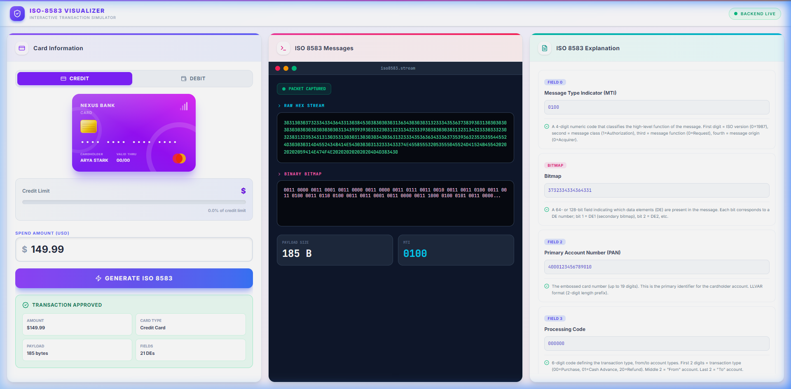

# ISO-8583 Interactive Visualizer 🛡️


A professional **ISO-8583 Protocol Debugger** and Simulator. Designed for FinTech engineers to visualize, validate, and decompose financial messages in real-time.



## 🚀 Features
- **✨ Dynamic User Interface**: Modern, glassmorphism-based design with smooth `Framer Motion` animations.
- **💳 Instrument Simulation**: Toggle between realistic **Credit Card** (limit-enforced) and **Debit Card** (savings-enforced) behaviors.
- **⚡ Real-time Packet Generation**: Instantly encode `0100` Authorization Requests using the `pyiso8583` standard library.
- **🔍 Deep Analysis (Triple-Panel)**:
  - **Left**: Card Simulator & Transaction Control with an educational "About ISO 8583" guide.
  - **Center**: Live Packet Capture terminal showing Raw Hex Streams and Binary Bitmaps.
  - **Right**: Field-by-field breakdown with encyclopedic descriptions, mapping DE formats (LLVAR, n, ans).
- **🎓 Educational Focus**: Built-in guide explaining Message Type Indicators (MTI), Bitmaps, and Data Elements (DE).

## 🌐 The 3-Panel Visualization Flow
1. **Interactive Inputs**: Simulated card environment with real-time balance/usage indicators.
2. **Protocol Stream**: macOS-style terminal console capturing every byte of the outgoing message.
3. **Element Explanation**: Detailed data dictionary mapping every active field to its standard ISO specification.

## 🛠️ Tech Stack
- **Frontend**: React 18, Vite, Tailwind CSS v4, Framer Motion, Lucide Icons, Axios.
- **Backend**: Python 3.9+, FastAPI, `pyiso8583`.
- **Styling**: Premium UI with mesh gradients, backdrop-filters, and high-fidelity typography.

## 📦 Getting Started

### 🐳 Running with Docker (Recommended)

The easiest way to run the entire application stack is using Docker Compose. This starts the FastAPI backend and the Vite React frontend (served via Nginx) in a unified container network.

1. **Build and start the services**:
   ```bash
   docker compose up --build
   ```

2. **Access the application**:
   - Web UI: [http://localhost:8080](http://localhost:8080)
   - Backend API: [http://localhost:8001](http://localhost:8001)

*Nginx reverse-proxies frontend requests at `/api/*` to the FastAPI backend container internally, avoiding CORS issues.*

### 🛠️ Local Development (Manual Setup)

If you prefer to run the services manually without Docker:

#### 1. Backend Setup
```bash
cd backend
python -m venv venv
source venv/bin/activate  # On macOS/Linux (or venv\Scripts\activate on Windows)
pip install -r requirements.txt
python main.py
```

#### 2. Frontend Setup
```bash
cd frontend
npm install
npm run dev
```

## 📜 Key ISO-8583 Elements Tracked
| DE | Name | Standard Format | Purpose |
|---|---|---|---|
| 0 | MTI | n4 | Message Type Identifier |
| 1 | Bitmap | b64/128 | Data presence map |
| 2 | PAN | n..19 (LLVAR) | Primary Account Number |
| 3 | Processing Code | n6 | Transaction/Account types |
| 4 | Amount, Transaction | n12 | Transaction amount in cents |
| 7 | Transmission DateTime | n10 (MMDDhhmmss) | Global network timestamp |
| 11 | STAN | n6 | System Trace Audit Number |
| 12 | Local Time | n6 (hhmmss) | Time at point of transaction |
| 13 | Local Date | n4 (MMDD) | Date at point of transaction |
| 14 | Expiry Date | n4 (YYMM) | Card expiration date |
| 18 | MCC | n4 | Merchant Category Code |
| 22 | POS Entry Mode | n3 | Capture method (Chip, Stripe, etc.) |
| 37 | RRN | an12 | Retrieval Reference Number |
| 41 | Terminal ID | ans8 | Unique terminal identifier |
| 43 | Merchant Name | ans..40 (LLVAR) | Name, City, Country of merchant |
| 49 | Currency Code | n3 | ISO 4217 Currency (e.g., 840=USD) |

## ⚖️ License
This project is licensed under the **MIT License**. See the `LICENSE` file for details.

---
**Building software at the speed of thought.** ⚡
